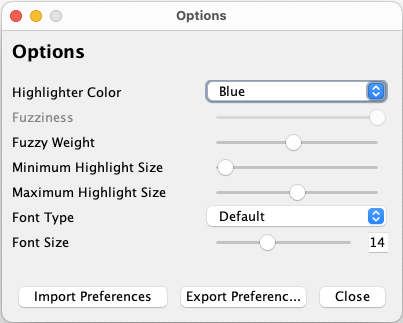

# Fuzzy Annotation Tool

This is a Java Swing based Fuzzy Annotation Tool, to be used in Named Entity annotation process.

In contrast to a "normal" annotation tool, this software does not enforce the concept of entity
boundaries, but instead attempts to bias the annotation in thinking that just a rough marking of the
concept is enough. The goal is to have annotations lose less time in attempting to mark of fix
entity span to be on the exact entity boundaries (which can be hard to define), thus increasing
annotation speed.

The created annotations are presented to the user as highlights with smooth transitions, as shown in
the figure:


# Operation modes

This software has support for two different types of annotation process, which generate different
annotation outputs when exported.

## Highlight annotation

Similar to more usual annotation tools, in this mode annotators have to highlight a text span to add
an annotation. The entity boundaries do not need to be exactly marked as the highlighted annotation
will have a similar size that the highlighted span.

## Point-wise annotation

In this mode, annotators must click a point in the text, preferably in the middle of an entity, to
create an annotation for that position. In this mode, the entity span is not relevant.

# Usage

The tool is provided as a single .jar or .exe file to be directly executed. There is no need for
installation or initial configuration.

*Java 17 is required to run the tool.* Can be downloaded from [here](https://www.java.com/download).

**NOTE:** User preferences are stored in the OS's registry system. Therefore, they are automatically
detected and applied independently of where the executable file is located.

## File selection screen

In this screen, the user must select what type of annotation process is going to be used (Point-wise
or highlight) (In-depth explanation in Section [Operation modes](#Operation-modes)) and select the
file containing the texts to be annotated (the file must comply with the restrictions written in
Section [Files](#Files), otherwise the software may not be able to parse it).


#### Screen elements

1. Operation mode radio buttons: Select in which operation mode the Annotation Tool will start.
2. `Select File`: Opens the window for XML file selection.
3. `Start`: Loads the selected file and starts the Annotation Tool in the Operation mode selected.
4. `Auto Save?` Checkbox: If checked, the annotations will be automatically saved to the selected
   file everytime the user changes the annotation text.
   **NOTE:** Please be aware that this option *overwrites* the original file when saving the
   annotations.

If a file containing annotations is selected as input, the tool is able to parse it and show as
highlighted text spans in the Annotation Screen (given that the annotation format matches the
Operation Mode selected, see the Section [Output file](#Output-file) for in depth explanation on the
annotation tag schema).

### Annotation screen

This is the main annotation window, where the user can select the entities in the current text.
Marked entities appear as highlighted sections in the text area.
The way the selection is done changes depending on the chosen [Operation mode](#Operation-modes).


#### Screen elements

1. `Tag` box: Tagged which the entity is annotated *(currently only `C` is supported)*
2. `Document` box: The number of the currently shown text document. A number can be typed to skip to
   the referring document. *(Support to reopen in the last evaluated document is foreseen)*
3. `Options` button: Open the [Options screen](#Options-screen)
4. `Prev` button: Returns to the previous document.
5. `Next`button: Advances to the next document.
6. `Undo` button: Removes the last annotation. Can be pressed multiple times until all annotations
   are removed.
7. `Export file` button: Saves the all loaded documents with the marked annotations to an XML file.
   If pressed, this button will open a file selection screen to save the data to a new file. This
   option is useful in the case the

**NOTE:** Currently the only way to remove annotations is through the `Undo` button. However, If the
user switches to another text or closes the application, the changes are definitely applied, and it
is impossible to remove.

## Options screen

This screen contains configuration parameters for the annotation highlight shown in the screen.

**NOTE:** This screen present advanced options which normally ***shouldn't be used by annotators*.**

**NOTE2:** *These parameters do not affect the actual annotation saved in the output file*. These
only affect the way the annotation is presented to the user in
the [Annotation Screen](#Annotation-Screen).



#### Screen elements

1. `Highlight color`: Changes the color in which the annotations are marked.
2. `Fuzziness` *(Only for highlight annotation)*: Modifies the fade out effect of the annotation. If
   set all the way to the right, the annotations will present hard boundaries.
3. `Fuzzy weight`: Modifies the shown length of the fuzzy annotation span. (
   ***Known bug:** *This only affects the current annotations. Annotations done after the
   modification of the parameter will not be affected by the span change effect)**
4. `Minimum Highlight Size` *(Only for point-wise annotation)*: Defines the smallest span length
   possible to be highlighted for an annotation.
5. `Maximium Highlight Size`*(Only for point-wise annotation)*: Defines the largest span length
   possible to be highlighted for an annotation.

# Files

XML based files are used as both input and output.

### Input file

The input file must contain one or more text documents wrapped in `<article>` tags. The text within
the tag is recognized as one document and read keeping its original formatting.
The whole set of `<article>` tags must be wrapped by a `<articles>` tag to differentiate the actual
annotatable text data from xml file metadata.

A file template is as follows:

```xml
<?xml version="1.0" encoding="UTF-8"?>
<articles>

    <article>
        TEXT HERE.
    </article>

    <article>
        ANOTHER TEXT HERE.
    </article>

</articles>
```

### Output file

The file saved by this software has a similar overall format as the input file, however, the newly
produced annotations are added to the text inside the `<article>` tag.

The produced tags are dependent on the [Operation mode](#Operation-modes) selected:

#### Highlight annotation

The annotated textual span is wrapped by `<C`> and `</C>` tags.
Example:

```
He was diagnosed with <C>transient angina</C> after a chest CT, 12-lead EKG, and lab draw.
```

#### Point-wise annotation

The exact annotation position is marked by a `<C />` tag.
Example:

```
He was diagnosed with transient <C/> angina after a chest CT, 12-lead EKG, and lab draw.
```
